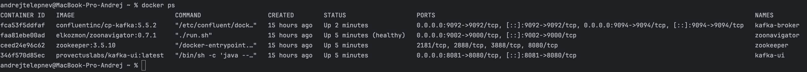
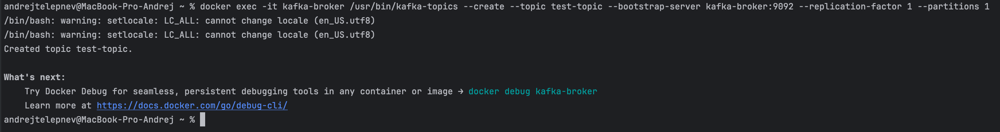
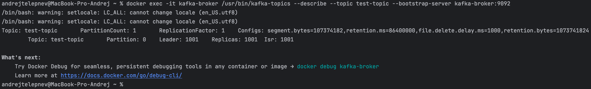
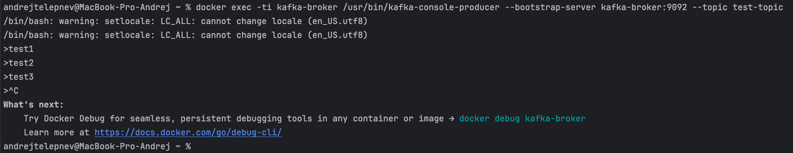
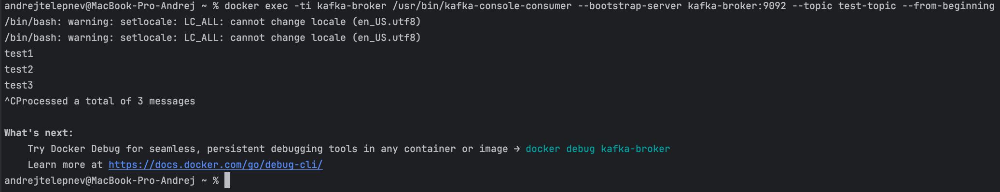
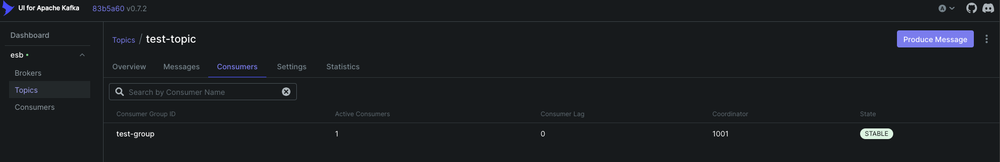
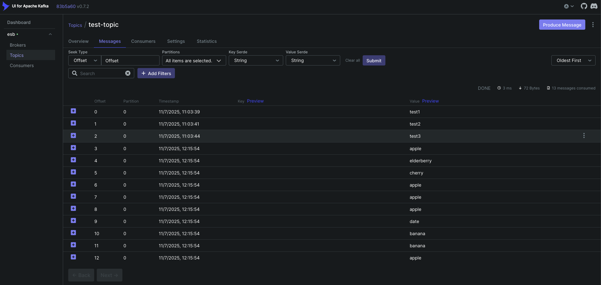

# Задание 2 Apache Kafka + Docker + Java

## Цель

Развернуть Apache Kafka в Docker с помощью docker-compose, создать тестовый топик, протестировать работу через CLI и написать два Java-приложения: Producer (отправляет сообщения) и Consumer (читает сообщения).

## Задание

### 1. Поднять окружение Kafka в Docker с помощью docker-compose.

Docker-compose:
[kafka-docker-compose](../../docker/lesson_2/kafka-docker-compose.yml)

### 2. Проверить, что все контейнеры работают.

Команды:

```
docker ps
```

Скриншоты:



### 3. Создать топик test-topic через команду в терминале.

Команды:

```
docker exec -it kafka-broker /usr/bin/kafka-topics --create --topic test-topic --bootstrap-server kafka-broker:9092 --replication-factor 1 --partitions 1
docker exec -it kafka-broker /usr/bin/kafka-topics --describe --topic test-topic --bootstrap-server kafka-broker:9092 
```

Скриншоты:





### 4. Отправить тестовые сообщения в топик через Kafka CLI.

Команды:

```
docker exec -ti kafka-broker /usr/bin/kafka-console-producer --bootstrap-server kafka-broker:9092 --topic test-topic
```

Скриншоты:



### 5. Прочитать сообщения из топика через Kafka CLI.

Команды:

```
docker exec -ti kafka-broker /usr/bin/kafka-console-consumer --bootstrap-server kafka-broker:9092 --topic test-topic --from-beginning
```

Скриншоты:



### 6. Написать Java Producer, который отправляет случайные данные (например, фрукты) в Kafka.

Код в классе [KafkaProducerExample](../../src/main/java/lesson2/KafkaProducerExample.java)

### 7. Написать Java Consumer, который читает эти данные.

Код в классе [KafkaConsumerExample](../../src/main/java/lesson2/KafkaConsumerExample.java)

### 8. Проверить отправку и получение через Kafka UI.

Скриншоты:




### 9. Остановить контейнеры и удалить все данные.