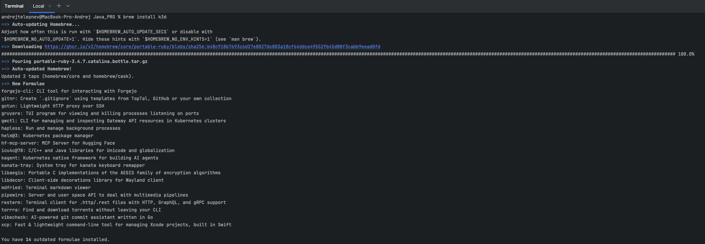
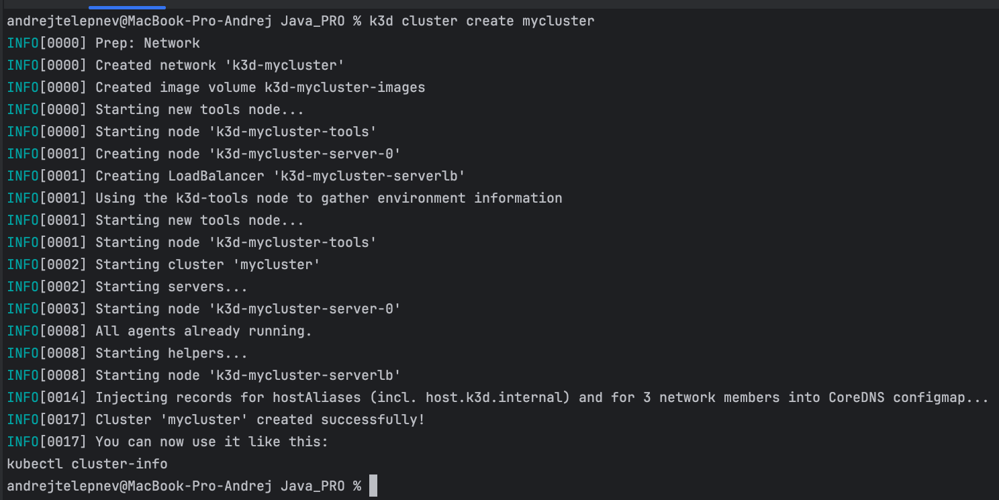
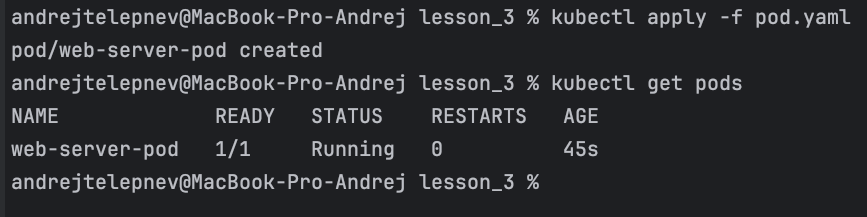
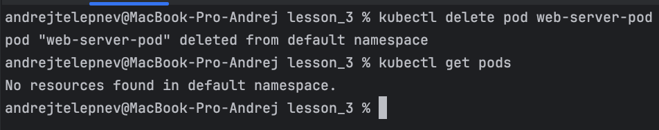
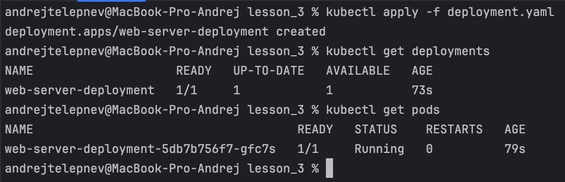
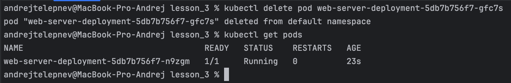
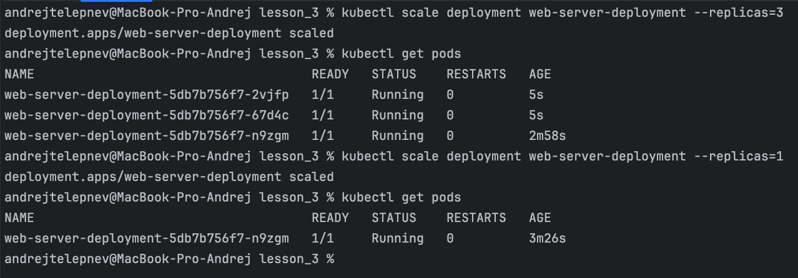
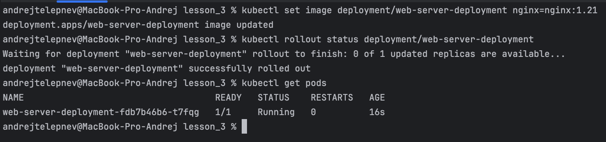

# Задание 3 Первый Deployment в Kubernetes

## Цели

Развернуть локальный кластер Kubernetes с помощью k3d.
Понять разницу между Pod, ReplicaSet и Deployment.
Научиться применять Deployment для самовосстановления приложения и масштабирования.

## Задание

### 1. Теория: Найти и записать своими словами определения: Pod, ReplicaSet, Deployment. Ответить на вопросы:

**Pod** - это минимальная единица развертывания в Kubernetes, которая содержит один или несколько контейнеров, работающих вместе. Это как "коробка", в которой живут связанные программы

**ReplicaSet** - это механизм, который следит за тем, чтобы было нужное число таких "коробок" (Pod). Если какая-то "коробка" сломается, ReplicaSet создаст новую, чтобы всё осталось в порядке.

**Deployment** - это инструмент, который управляет развертыванием и обновлением приложений. Он следит за тем, чтобы было нужное число "коробок" (Pod) и помогает обновлять их без перебоев.
   
**Почему Pod без контроллера не восстанавливается после удаления?**

Pod без контроллера не восстанавливается, потому что Kubernetes не отслеживает такие поды. Контроллеры, такие как ReplicaSet и Deployment, отслеживают состояние подов и автоматически восстанавливают их.

**Как Deployment понимает, какие Pod ему принадлежат?**

Deployment использует selector для определения, какие поды ему принадлежат. Selector — это набор ключевых значений меток, которые должны совпадать с метками подов, управляемых Deployment.

**Что делает стратегия RollingUpdate?**

Стратегия RollingUpdate последовательно заменяет старые поды новыми с новой версией, обеспечивая бесперебойную работу приложения.

**В чём разница между ReplicaSet и Deployment?**

ReplicaSet управляет количеством идентичных подов, а Deployment управляет обновлениями и масштабированием приложений, используя ReplicaSet.

**Что произойдёт, если selector не совпадает с метками в template?**

Если selector не совпадает с метками в template, Deployment не сможет управлять этими подами и не сможет их восстановить или обновить.

### 2. Практика

**Установить k3d и развернуть локальный кластер Kubernetes.**

Команды:

```
brew install k3d
k3d cluster create mycluster
```

Скриншоты:




**Подготовить манифест Pod с любым веб-сервером (например, nginx).**

Pod.yaml:
[kafka-docker-compose](../../docker/lesson_3/pod.yaml)

**Применить манифест и проверить, что Pod запустился.**

Команды:

```
kubectl apply -f pod.yaml
kubectl get pods
```

Скриншоты:



**Удалить Pod и зафиксировать, что он не восстанавливается.**

Команды:

```
kubectl delete pod web-server-pod
kubectl get pods
```

Скриншоты:



**Подготовить манифест Deployment с 1 репликой того же веб-сервера.**

Pod.yaml:
[kafka-docker-compose](../../docker/lesson_3/deployment.yaml)

**Применить манифест и проверить работу приложения.**

Команды:

```
kubectl apply -f deployment.yaml
kubectl get deployments
kubectl get pods
```

Скриншоты:



**Удалить Pod и убедиться, что Kubernetes создал новый.**

Команды:

```
kubectl delete pod web-server-deployment-5db7b756f7-gfc7s
kubectl get pods
```

Скриншоты:



**Выполнить масштабирование Deployment до 3 реплик, а затем вернуть обратно на 1.**

Команды:

```
kubectl scale deployment web-server-deployment --replicas=3
kubectl get pods
kubectl scale deployment web-server-deployment --replicas=1
kubectl get pods
```

Скриншоты:



**Обновить версию образа в Deployment и проверить, что обновление прошло без простоя.**

Команды:

```
kubectl set image deployment/web-server-deployment nginx=nginx:1.21
kubectl rollout status deployment/web-server-deployment
kubectl get pods
```

Скриншоты:



### 3. Что сдать
   Файл(ы) манифестов:
   pod.yaml (минимальный, с комментариями к основным полям)
   deployment.yaml (с комментариями к selector, template и стратегии)
   Краткий отчёт:
   Определения Pod, ReplicaSet, Deployment
   Ответы на теоретические вопросы
   Краткое описание, что произошло при удалении Pod в обоих случаях
   Скриншоты/выводы до и после масштабирования и обновления
### 4. Критерии оценки
   Манифесты валидны и применяются без ошибок.
   Показано самовосстановление Pod под управлением Deployment.
   Теоретическая часть выполнена своими словами.