# Задание 4 Kubernetes контроллеры

## Задание

### 1. DaemonSet 

**Создать DaemonSet, который на каждом узле кластера запускает контейнер busybox, каждые 60 секунд выводящий текст "Hello from $(hostname)".**

Daemonset.yaml:
[daemonset.yaml](../../docker/lesson_4/daemonset.yaml)

Команды:

```
kubectl apply -f daemonset.yaml
```

Скриншоты:

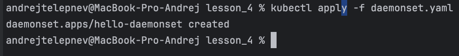

**Проверить, что Pod запустился на каждом ноде (kubectl get pods -o wide).**

Команды:

```
kubectl get pods -o wide
```

Скриншоты:

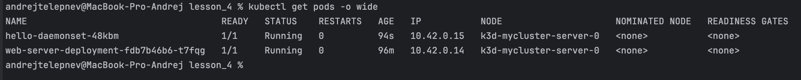

**Прочитать логи любого Pod.**

Команды:

```
kubectl logs hello-daemonset-48kbm
```

Скриншоты:

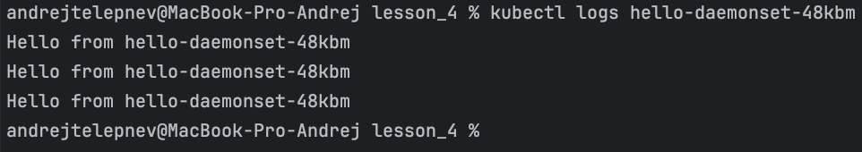

**Удалить DaemonSet.**

Команды:

```
kubectl delete daemonset hello-daemonset
kubectl get pods -o wide

```

Скриншоты:

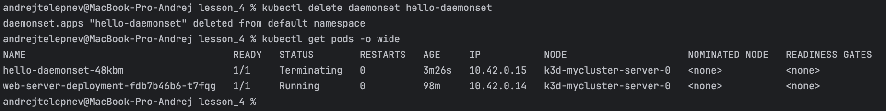

### 2. StatefulSet

**Создать StatefulSet с 3 репликами, в котором Pod выводит в консоль "Hello from pod <имя pod>" и спит 300 секунд.**

Statefulset.yaml:
[statefulset.yaml](../../docker/lesson_4/statefulset.yaml)

Команды:

```
kubectl apply -f statefulset.yaml
```

Скриншоты:

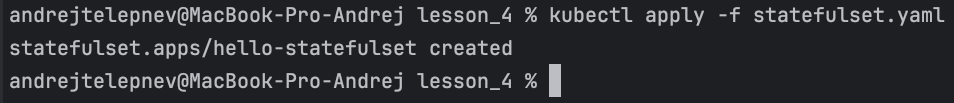

**Проверить, что имена Pod идут с суффиксами -0, -1, -2.**

Команды:

```
kubectl get pods
```

Скриншоты:

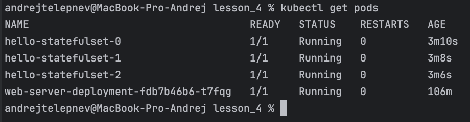

**Удалить один Pod и убедиться, что он пересоздаётся с тем же именем.**

Команды:

```
kubectl delete pod hello-statefulset-1
kubectl get pods
```

Скриншоты:

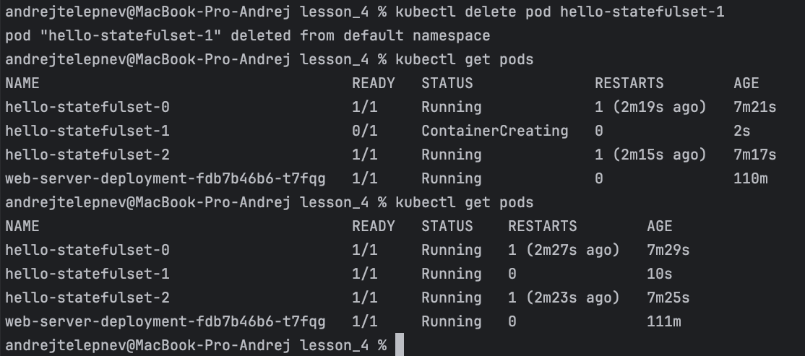

**Удалить StatefulSet и убедиться, что Pod удалены.**

Команды:

```
kubectl delete statefulset hello-statefulset
kubectl get pods
```

Скриншоты:

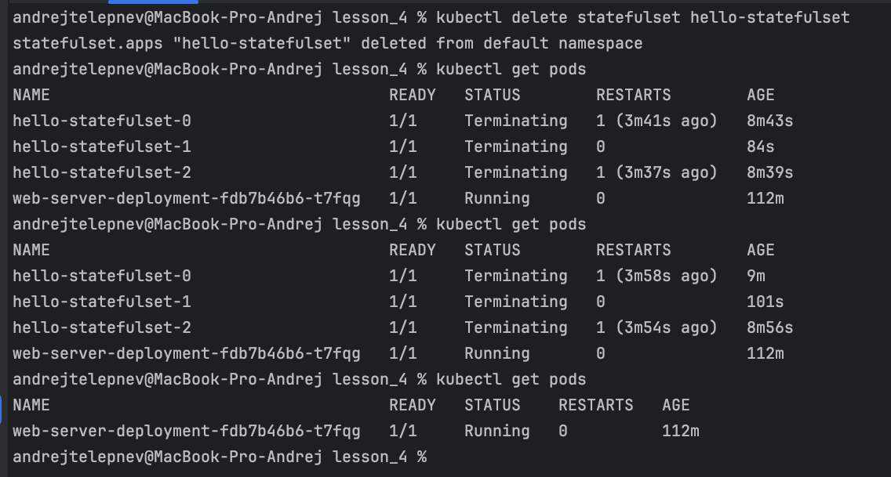

### 3. Job

**Создать Job, который один раз выводит "Hello from Kubernetes" и завершается.**

Job.yaml:
[job.yaml](../../docker/lesson_4/job.yaml)

Команды:

```
kubectl apply -f job.yaml
```

Скриншоты:

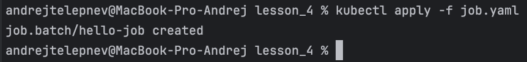

**Проверить статус Job (kubectl get jobs).**

Команды:

```
kubectl get jobs
```

Скриншоты:

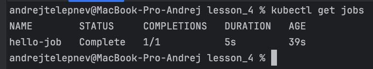

**Прочитать логи Pod, созданного Job.**

Команды:

```
kubectl get pods
kubectl logs hello-job-jsslr
```

Скриншоты:

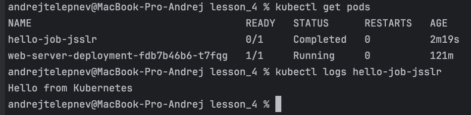

**Удалить Job.**

Команды:

```
kubectl delete job hello-job
kubectl get jobs
```

Скриншоты:

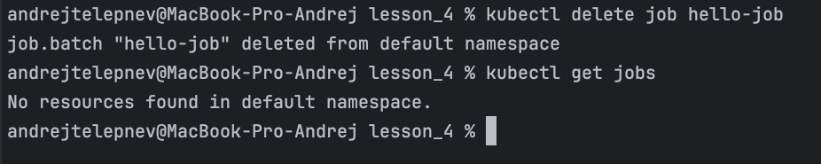

### 4. CronJob

**Создать CronJob, который каждую минуту пишет текущее время в лог.**

Cronjob.yaml:
[cronjob.yaml](../../docker/lesson_4/cronjob.yaml)

Команды:

```
kubectl apply -f cronjob.yaml
```

Скриншоты:

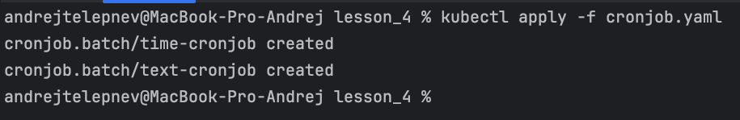

**Проверить, что создаются новые Job по расписанию (kubectl get jobs).**

Команды:

```
kubectl get jobs
```

Скриншоты:

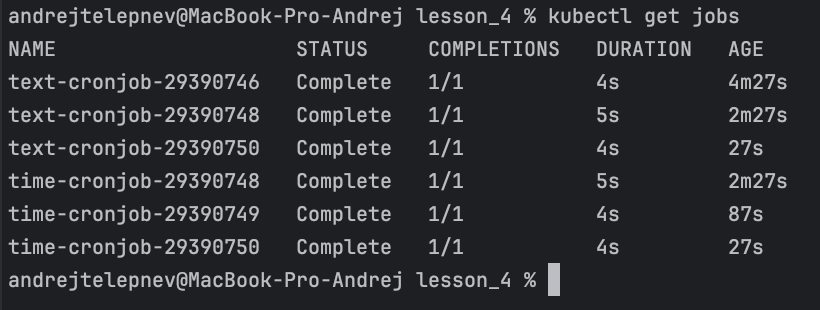

**Прочитать логи последнего Job.**

Команды:

```
kubectl get pods --selector=job-name=$(kubectl get jobs --sort-by=.metadata.creationTimestamp -o jsonpath='{.items[-1].metadata.name}') -o jsonpath='{.items[0].metadata.name}'
kubectl logs time-cronjob-29390764-2hgsn
```

Скриншоты:

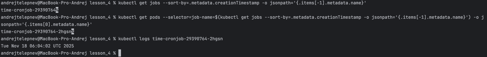

**Ограничить хранение истории до 3 успешных и 1 неуспешного Job.**

Команды:

```
kubectl patch cronjob time-cronjob -p '{"spec":{"successfulJobsHistoryLimit":4,"failedJobsHistoryLimit":2}}'
kubectl get cronjob time-cronjob -o yaml
kubectl patch cronjob time-cronjob -p '{"spec":{"successfulJobsHistoryLimit":3,"failedJobsHistoryLimit":1}}'
kubectl get cronjob time-cronjob -o yaml
```

Скриншоты:

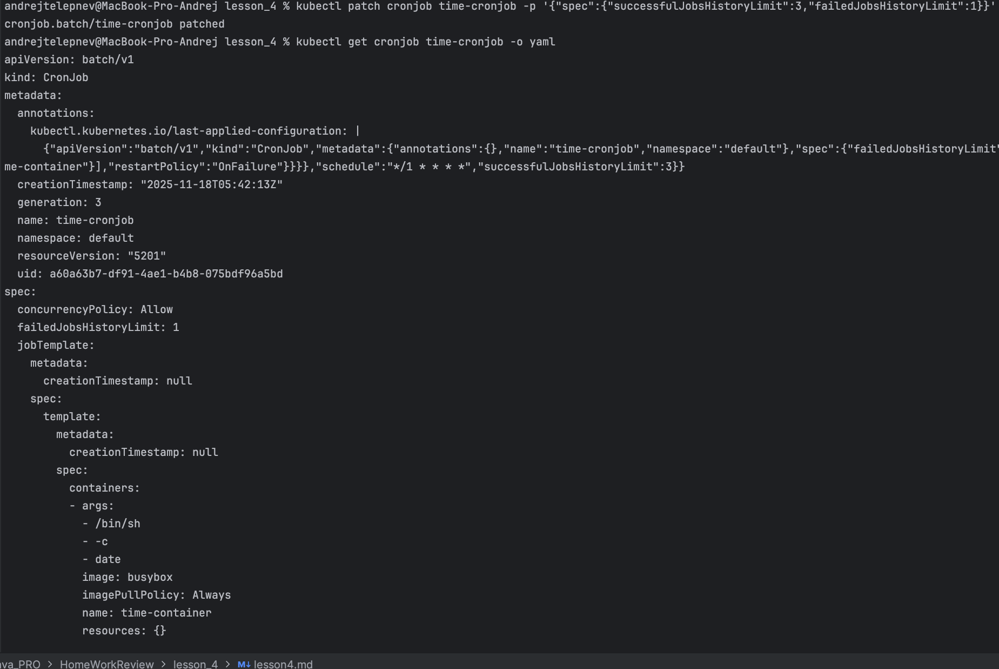

**Создать второй CronJob, который каждые 2 минуты выводит произвольный текст. Запустить CronJob вручную через kubectl create job --from=cronjob/...**

Команды:

```
kubectl create job --from=cronjob/text-cronjob manual-text-job
kubectl get jobs
```

Скриншоты:

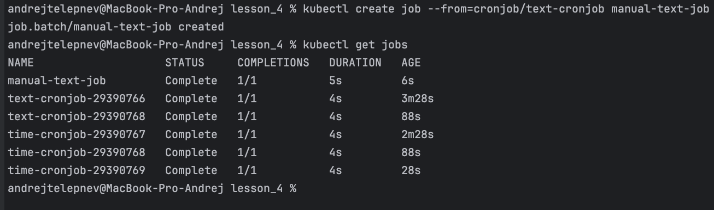