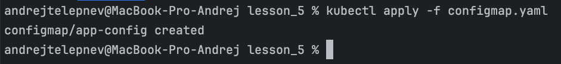
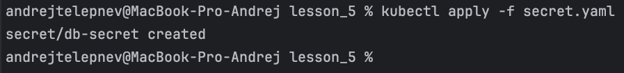
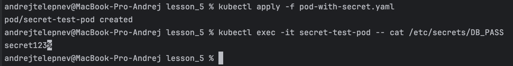
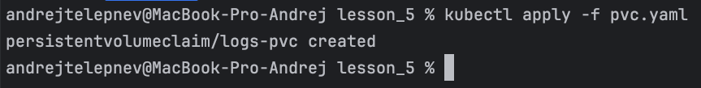
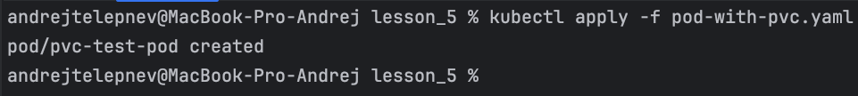
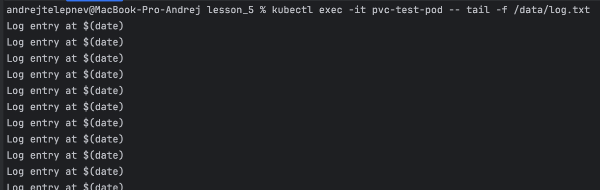
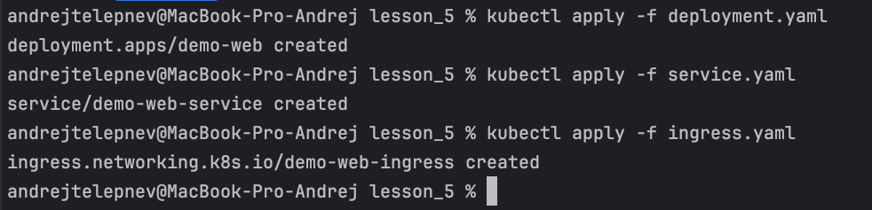
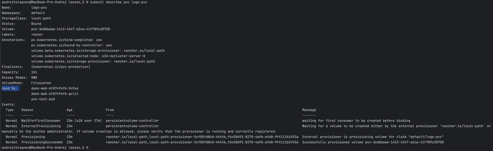
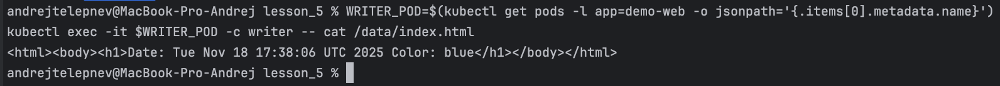
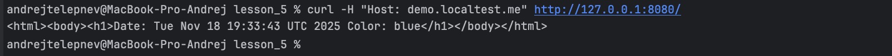

# Задание 5 Kubernetes сущности

## Задание

### 1. ConfigMap как источник конфигурации

**Создай ConfigMap app-config с ключами: APP_MODE=dev APP_COLOR=blue**

Configmap.yaml:
[configmap.yaml](../../docker/lesson_5/configmap.yaml)

Команды:

```
kubectl apply -f configmap.yaml
```

Скриншоты:



**Подключи ConfigMap в контейнер как переменные окружения. Проверь внутри пода командой: env | grep APP_**

Pod-with-configmap.yaml:
[pod-with-configmap.yaml](../../docker/lesson_5/pod-with-configmap.yaml)

Команды:

```
kubectl apply -f pod-with-configmap.yaml
kubectl exec -it configmap-test-pod -- sh -c "env | grep APP_"
```

Скриншоты:


### 2. Secret для чувствительных данных

**Создай Secret db-secret с ключами: DB_USER=demo DB_PASS=secret123**

Secret.yaml:
[secret.yaml](../../docker/lesson_5/secret.yaml)

Команды:

```
kubectl apply -f secret.yaml
```

Скриншоты:



**Примонтируй Secret в под в каталог /etc/secrets. Проверь внутри пода: cat /etc/secrets/DB_PASS**

Pod-with-secret.yaml:
[pod-with-secret.yaml](../../docker/lesson_5/pod-with-secret.yaml)

Команды:

```
kubectl apply -f pod-with-secret.yaml
kubectl exec -it secret-test-pod -- cat /etc/secrets/DB_PASS
```

Скриншоты:



### 3. PVC для хранения данных

**Создай PVC logs-pvc размером 1Gi.**

Pvc.yaml:
[pvc.yaml](../../docker/lesson_5/pvc.yaml)

Команды:

```
kubectl apply -f pvc.yaml
```

Скриншоты:



**Запусти под с образом busybox, который каждые 5 секунд пишет строку в файл /data/log.txt.**

Pod-with-pvc.yaml:
[pod-with-pvc.yaml](../../docker/lesson_5/pod-with-pvc.yaml)

Команды:

```
kubectl apply -f pod-with-pvc.yaml
```

Скриншоты:



**Проверь: kubectl exec -it <pod-name> -- tail -f /data/log.txt**

Команды:

```
kubectl exec -it pvc-test-pod -- tail -f /data/log.txt
```

Скриншоты:



### 4. Комплексный Deployment

**Создай Deployment demo-web с двумя контейнерами: 
nginx, который раздаёт файлы из /usr/share/nginx/html. 
writer, который пишет в PVC файл index.html (дата + значение переменной $APP_COLOR).
Настрой Service и Ingress (demo.localtest.me).**

Deployment.yaml:
[deployment.yaml](../../docker/lesson_5/deployment.yaml)

Команды:

```
kubectl apply -f deployment.yaml
kubectl apply -f service.yaml
kubectl apply -f ingress.yaml
kubectl get cm,secret,pvc,pod,svc,ing
kubectl describe pvc logs-pvc
WRITER_POD=$(kubectl get pods -l app=demo-web -o jsonpath='{.items[0].metadata.name}')
kubectl exec -it $WRITER_POD -c writer -- cat /data/index.html
sudo sh -c 'echo "127.0.0.1 demo.localtest.me" >> /etc/hosts'
curl -H "Host: demo.localtest.me" http://127.0.0.1:8080/
```

Скриншоты:










### Чек-лист проверок

kubectl get cm,secret,pvc,pod,svc,ing — все ресурсы в статусе Running/Bound.
kubectl describe pvc logs-pvc — статус Bound.
kubectl exec -it <writer-pod> -- cat /data/index.html — файл содержит данные.
curl -H "Host: demo.localtest.me" http://127.0.0.1:8080/ — страница открывается.